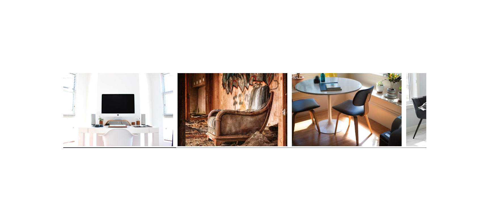

# Hesh - Ikea carousel clone 

## Table of contents

- [Overview](#overview)
  - [Screenshot](#screenshot)
  - [Links](#links)
- [My process](#my-process)
  - [Built with](#built-with)
- [Author](#author)

## Overview
This is a component for a QR code

### Screenshot

### Links

- Project GitHub URL: (https://github.com/heshamelmasry77/ikea-clone-carousel-hesh/)
- Live Site URL: (https://ikea-clone-carousel-hesh.vercel.app/)

## My process

### Built with

- HTML markup
- CSS custom properties
- Flexbox
- JS

## Author

- Website - [Hesham El Masry](https://github.com/heshamelmasry77)
- Linkedin - [/in/heshamelmasry7/](https://www.linkedin.com/in/heshamelmasry7/)
